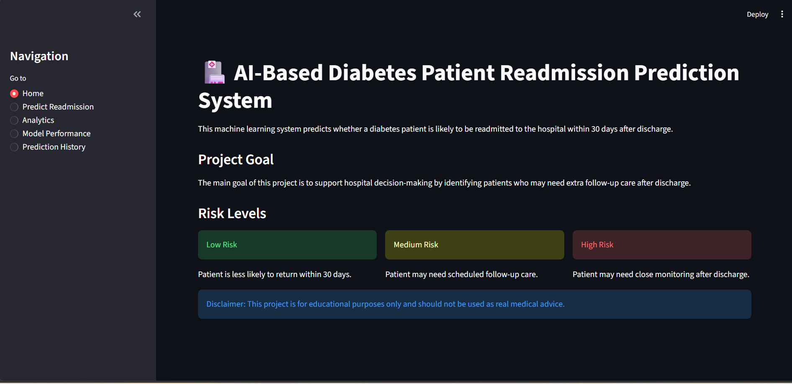
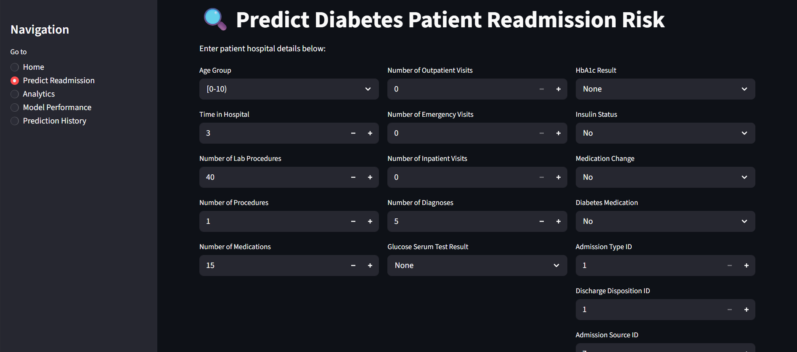
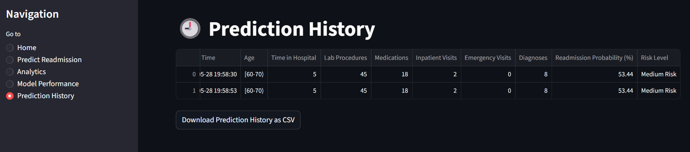
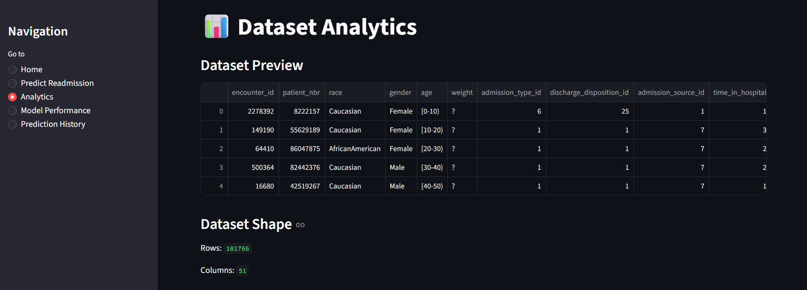
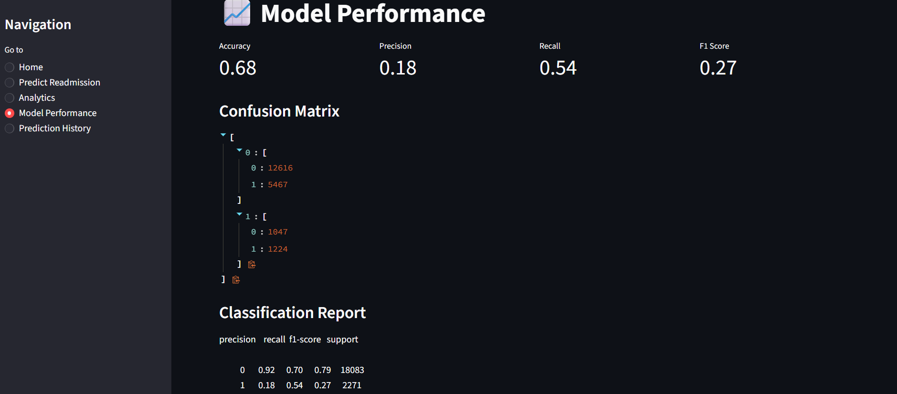
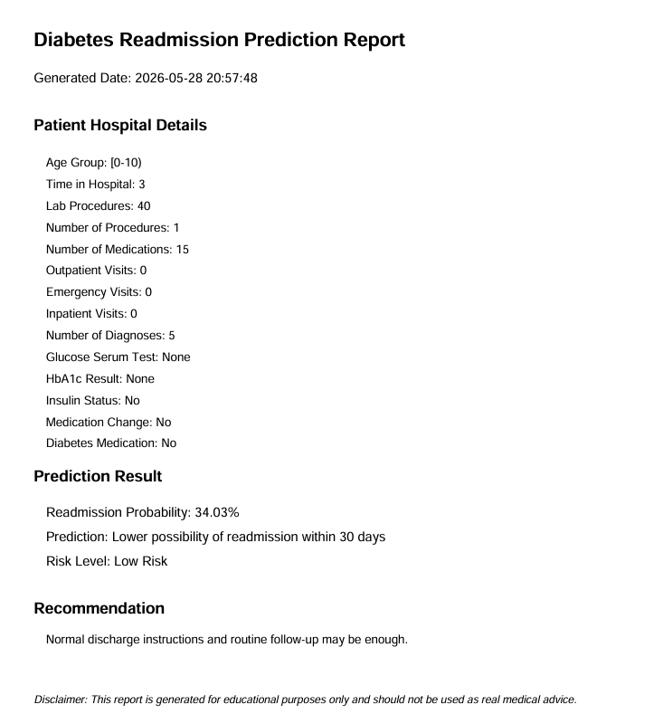

# AI-Based Diabetes Patient Readmission Prediction System

## Live Demo

You can try the deployed app here:

[Diabetes Readmission Prediction System](Add your Streamlit deployed link here)

---

## Diabetes Readmission Prediction System

This is an AI-based healthcare prediction system that predicts whether a diabetes patient is likely to be readmitted to the hospital within 30 days after discharge.

This project is more advanced than a normal diabetes prediction system because it focuses on a real-world hospital problem: identifying high-risk patients after discharge and supporting better follow-up care decisions.

---

## Project Overview

The main goal of this project is to analyze diabetes patient hospital records and build a machine learning model that can predict hospital readmission risk.

The system allows users to enter patient hospital details and receive:

- Readmission probability
- Prediction result
- Risk level: Low, Medium, or High
- Medical follow-up recommendation
- Downloadable PDF prediction report
- Prediction history
- Dataset analytics
- Model performance summary

---

## Screenshots

### Home Page



### Prediction Page



### Prediction Result



### Analytics Dashboard



### Model Performance



### PDF Report



---

## Technologies Used

- Python
- Pandas
- NumPy
- Scikit-learn
- Streamlit
- Joblib
- ReportLab
- Matplotlib
- Seaborn

---

## Dataset

The dataset used for this project is the Diabetes 130-US Hospitals dataset.

The dataset contains hospital records of diabetes patients, including patient demographics, hospital admission details, treatment information, medication details, and readmission status.

Important features used in this project include:

- Age
- Time in hospital
- Number of lab procedures
- Number of procedures
- Number of medications
- Number of outpatient visits
- Number of emergency visits
- Number of inpatient visits
- Number of diagnoses
- Glucose serum test result
- HbA1c result
- Insulin status
- Medication change
- Diabetes medication status
- Admission type
- Discharge disposition
- Admission source

---

## Target Variable

The target column is:

```text
readmitted
```

Original values:

```text
<30  : Patient was readmitted within 30 days
>30  : Patient was readmitted after 30 days
NO   : Patient was not readmitted
```

For this project, the target was converted into a binary classification problem:

```text
1 : Patient is likely to be readmitted within 30 days
0 : Patient has a lower possibility of readmission within 30 days
```

---

## Main Features

- Add diabetes patient hospital details
- Predict 30-day readmission possibility
- Show readmission probability
- Classify risk as Low, Medium, or High
- Display healthcare recommendation
- Download PDF prediction report
- View dataset analytics
- View model performance
- Store prediction history during the session
- Download prediction history as CSV

---

## Risk Level Classification

The model predicts a probability score. Based on the probability, the system classifies the patient into a risk level.

```text
0% - 39%   : Low Risk
40% - 69%  : Medium Risk
70% - 100% : High Risk
```

---

## Project Workflow

1. Loaded the diabetes hospital dataset
2. Replaced invalid missing values
3. Selected important patient and hospital-related features
4. Converted the readmission column into a binary target variable
5. Separated numerical and categorical features
6. Applied preprocessing using imputation, scaling, and one-hot encoding
7. Split the dataset into training and testing sets
8. Trained a Random Forest Classifier
9. Evaluated the model using accuracy, precision, recall, F1-score, and confusion matrix
10. Saved the trained model using Joblib
11. Built an interactive Streamlit web application
12. Added PDF report generation using ReportLab
13. Added prediction history and analytics pages
14. Prepared the project for GitHub and Streamlit deployment

---

## Machine Learning Model

The project uses a Random Forest Classifier.

Random Forest was selected because it performs well on structured tabular datasets and can handle both numerical and encoded categorical features effectively.

The model was trained using a Scikit-learn pipeline that includes:

- Missing value handling
- Feature scaling for numerical columns
- One-hot encoding for categorical columns
- Random Forest classification model

---

## Model Evaluation

The model was evaluated using the following metrics:

- Accuracy
- Precision
- Recall
- F1-score
- Confusion Matrix
- Classification Report

In this healthcare project, recall is important because the system should reduce the chance of missing patients who may actually be at high risk of readmission.

---

## Streamlit Application Pages

### Home Page

The home page explains the purpose of the system, risk levels, and project disclaimer.

### Predict Readmission Page

The prediction page allows the user to enter patient hospital details and generate a readmission risk prediction.

### Analytics Page

The analytics page displays dataset information, readmission distribution, age distribution, and average hospital record values.

### Model Performance Page

The model performance page displays accuracy, precision, recall, F1-score, confusion matrix, and classification report.

### Prediction History Page

The prediction history page stores predictions made during the current session and allows users to download them as a CSV file.

---

## How to Run This Project

### 1. Clone the repository

```bash
git clone Add your GitHub repository link here
```

### 2. Go to the project folder

```bash
cd diabetes-readmission-prediction
```

### 3. Create a virtual environment

```bash
python -m venv .venv
```

### 4. Activate the virtual environment

For Windows:

```bash
.venv\Scripts\activate
```

### 5. Install required libraries

```bash
pip install -r requirements.txt
```

### 6. Train the model

```bash
python train_model.py
```

### 7. Run the Streamlit app

```bash
streamlit run app.py
```

---

## Project Structure

```text
diabetes-readmission-prediction/
│
├── app.py
├── train_model.py
├── requirements.txt
├── README.md
├── .gitignore
│
├── diabetes_readmission_model.pkl
├── selected_features.pkl
├── model_metrics.pkl
│
├── data/
│   └── diabetic_data.csv
│
└── images/
    ├── home.png
    ├── prediction-page.png
    ├── prediction-result.png
    ├── analytics.png
    ├── model-performance.png
    └── pdf-report.png
```

---

## Requirements

```text
pandas
numpy
matplotlib
seaborn
scikit-learn
streamlit
joblib
reportlab
```

---

## Future Improvements

- Add doctor and admin login
- Store prediction history in a database
- Add patient profile management
- Add more advanced model comparison
- Add XGBoost model
- Add explainable AI using SHAP
- Add full hospital dashboard
- Add React, Node.js, and MongoDB version
- Deploy as a full-stack healthcare decision support system

---

## Disclaimer

This project is developed for educational and portfolio purposes only. It should not be used as a real medical diagnosis or clinical decision-making system.

---

## Author

Developed as a machine learning and Streamlit healthcare prediction project.